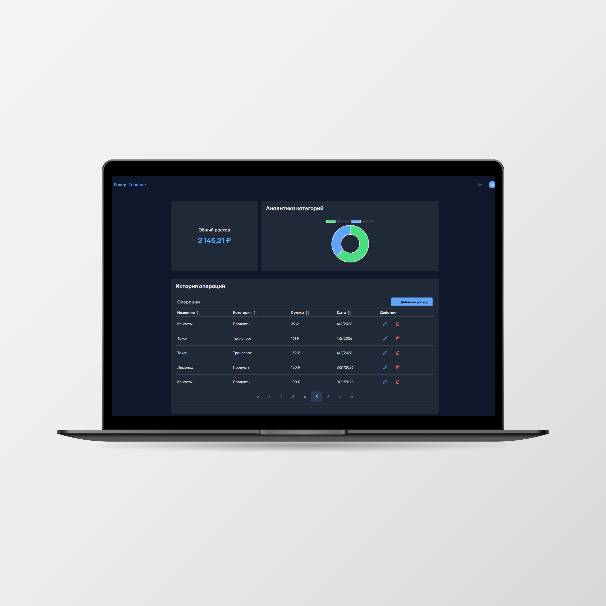
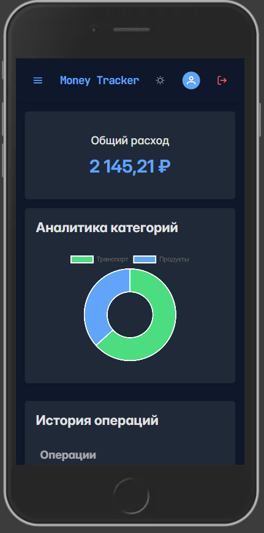
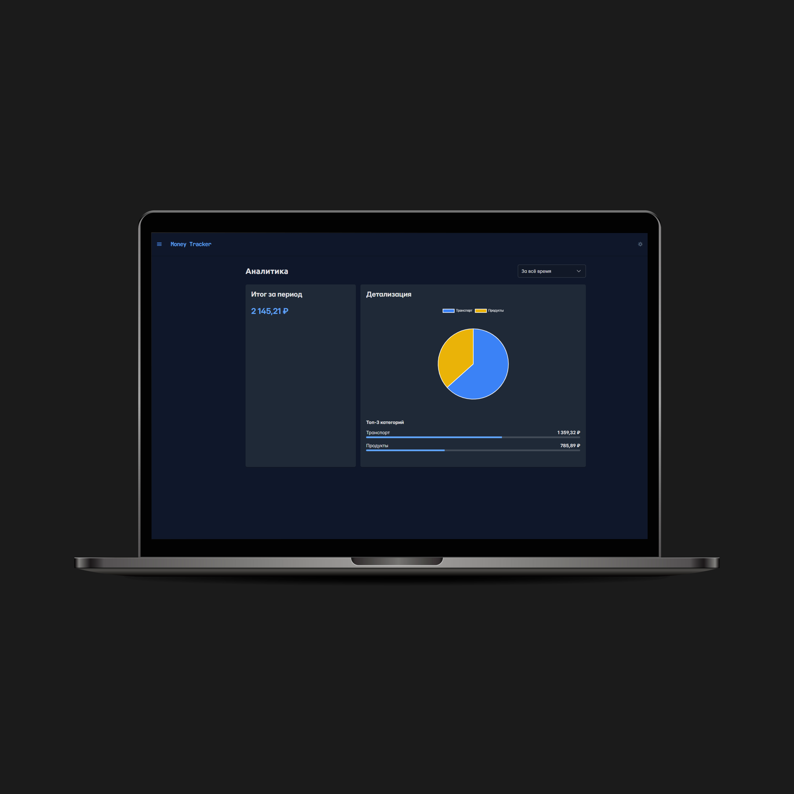
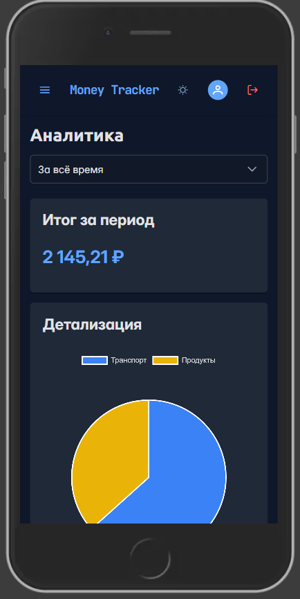

# 💰 Expense Tracker — Frontend

SPA-приложение для учета личных финансов с аналитикой расходов и защищённой авторизацией.

---

## 🚀 О проекте

Клиентская часть fullstack-приложения.  
Реализует интерфейс для работы с транзакциями, категориями и аналитикой, взаимодействует с backend через REST API.

---

### Интерфейс приложения

| Desktop View | Mobile View |
| :---: | :---: |
|  |  
| :---: | :---: |
|  | 

---

## 🛠 Стек технологий

- React 18 (Vite)
- Zustand — управление состоянием
- React Router v6 — маршрутизация и приватные роуты
- PrimeReact — UI-компоненты
- Axios — работа с API
- Chart.js — визуализация данных
- Framer Motion — анимации

---

## 🧱 Архитектура

- SPA с клиент-серверным взаимодействием
- Разделение на слои: UI / state / API
- Глобальное состояние через Zustand
- API-слой для работы с backend (Axios)
- Защита маршрутов через JWT

---

## ✨ Реализованный функционал

- 🔐 Авторизация и регистрация (JWT)
- 🔒 Защищенные маршруты
- 💸 CRUD операций (доходы/расходы)
- 🗂 Категории транзакций
- 📊 Аналитика расходов (графики)
- 🌓 Тёмная тема
- 📱 Адаптивная верстка

---

## 🔗 Взаимодействие с backend

Frontend взаимодействует с backend через REST API:

- авторизация (JWT)
- получение данных пользователя
- операции с транзакциями
- работа с категориями

---

## 📦 Установка и запуск

```bash
npm install
npm run dev
